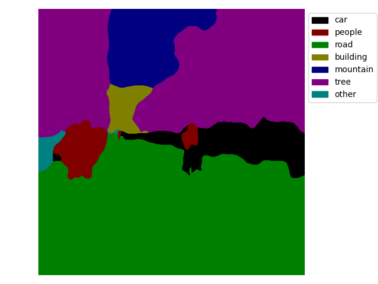

# LSeg-TensorRT
This project is an acceleration of the deployment of paper [Language-driven Semantic Segmentation](https://arxiv.org/abs/2201.03546)(ICLR 2022) by using TensorRT. The official code for the paper is [lang-seg](https://github.com/isl-org/lang-seg/tree/main).
# Introduction

**LSeg**, a novel model for language-driven semantic image segmentation. LSeg uses a text encoder to compute embeddings of descriptive input labels (e.g., ''grass'' or 'building'') together with a transformer-based **image encoder** that computes dense per-pixel embeddings of the input image. The image encoder is trained with a contrastive objective to align pixel embeddings to the text embedding of the corresponding semantic class. The text embeddings provide a flexible label representation in which semantically similar labels map to similar regions in the embedding space (e.g., ''cat'' and ''furry''). This allows LSeg to generalize to previously unseen categories at test time, without retraining or even requiring a single additional training sample. Experimental results demonstrate that LSeg achieves highly competitive zero-shot performance compared to existing zero- and few-shot semantic segmentation methods, and even matches the accuracy of traditional segmentation algorithms when a fixed label set is provided.

## Visualization of inference (FP32)
<table>
    <tr>
        <td></td>
        <td></td>
        <td></td>
        <td></td>
    </tr>
    <tr>
        <td></td>
        <td></td>
        <td></td>
        <td></td>
    </tr>
    <tr>
        <td></td>
        <td></td>
        <td></td>
        <td></td>
    </tr>
</table>


# Quick Start
If you don't want to spend the effort to export the ONNX model of CLIP by yourself, you can download the ONNX model of the clip_text part from this link: [clip_onnx](https://github.com/Lednik7/CLIP-ONNX).


## Dependencies installation

To begin on your own machine, clone this repository locally
```bash
git clone https://github.com/xiaolu-luu/LSeg-TensorRT.git
```
We strongly recommend using docker container for fast deployment
```bash
sudo docker run -itd -e NVIDIA_VISIBLE_DEVICES=0 --gpus all --name trt --runtime=nvidia \
        --shm-size 16G --ulimit memlock=-1 --ulimit stack=67108864  \
        -v /home/user/Desktop:/work nvcr.io/nvidia/pytorch:24.06-py3 /bin/bash
```
Install requirements:
```bash
docker exec -it trt /bin/bash
sh requirements.sh
```

## Export ONNX
Since the text encoder of LSeg is a frozen clip text encoder (CLIP ViT-B/32), we modified the original model of LSeg to export only the LSeg image encoder (ViT-L/16).
```bash
cd LSeg-TensorRT
# exporting clip-text and clip-vision (unused)
python clip_onnx_export.py 
# exporting LSeg-vision
python lseg_export.py
```

## Build engine and run

```bash
python enginerun.py >./log/run1.log 2>&1
```
## Performance comparison

|  Frame    |  batch |   encode_image |   encode_text |    total(ms) |
|:---------:|:------:|:--------------:|:-------------:|:------------:|
| Pytorch   |      1 |   551.931      |       12.5647 |   564.4957   |
| Onnx      |      1 |   255.234      |        4.3342 |   259.5682   |
| TensorRT  |      1 |   166.4077     |        2.6548 |   169.0625   |

# Advanced Usage (Unnecessary)
The various performance testing codes employed during engine construction are provided, including error localization by comparing layer-wise outputs using Polygraphy, as well as the analysis of inference speed and accuracy loss across PyTorch, ONNX Runtime, and TensorRT.

1. Test the results of pytorch and onnxruntime
```bash
python testlseg.py >./log/test_onnxruntime.log 2>&1
```
2. Compare the output between Onnxruntime and TensorRT
```bash
# More usage in polygraph.sh
polygraphy run ./onnx/lseg.onnx \
    --onnxrt --trt \
    --save-engine=./engines/lseg_poly.plan \
    --pool-limit workspace:5G \
    --onnx-outputs output \
    --trt-outputs output \
    --input-shapes   'input:[1,3,480,480]' \
    --atol 1e-3 --rtol 1e-3 \
    --verbose \
    > ./log/result-poly.log 2>&1
```

# 补充信息
LSeg模型的部署难点：

1、官方的LSeg在环境搭建上不太友好，PyTorch-Encoding的编译安装需要注意与CUDA的版本依赖,本仓库不依赖PyTorch-Encoding，由于只需要做模型推理，所以只使用更友好的Timm加载模型。

2、LSeg的原模型是双输入双输出的，不便于导出ONNX模型，由于LSeg的text encoder部分采用的是冻结的 CLIP ViT-B/32，因此我们只需要导出LSeg的 image encoder 部分，text encoder 部分采用CLIP的ONNX模型，因此我们修改了原模型的结构，去除了text encoder部分，只保留image encoder的单输入单输出模型用于导出。

3、LSeg包含4维矩阵乘，影响计算速度，同时8.6.1版本的TensorRT在计算4维MatMal时居然出错了，因此直接的方法是升级TensorRT到10之后，同时可以将4DMM转为2DMM进行计算。

